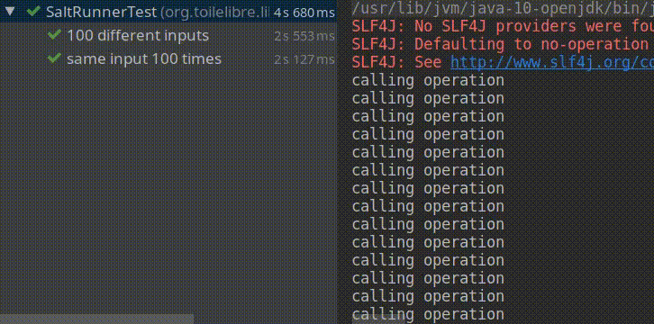

# coroutines-pooling-client
This is how we can pool several backend calls with the same exact input using kotlin coroutines

[Look at the unit test](src/test/kotlin/org/toilelibre/libe/poolingclient/SaltRunnerTest.kt)
